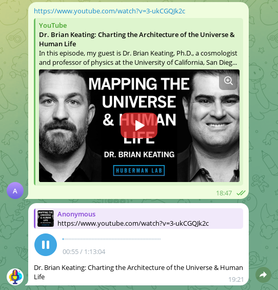

# Voiceify Bot

A Telegram bot designed to simplify reading articles from websites. Bot convert
articles from URI, rewrite video subtitles or read test message.



## Features

- [x] Read text message;
- [x] Read articles by URI;
- [x] Read text documents;
- [x] Convert subtitles to structured article and read it;
- [x] Support Russian and English voices.

## Build

Clone repository and start following command:

```sh
mvn package assembly:single
```

## Usage

Start application using following command:

```sh
java -jar target/voiceify-0.0.1-SNAPSHOT-jar-with-dependencies.jar \
  --bot-token "TOKEN" \
  --allow-user ID1 \
  --allow-user ID2 \
  --allow-user ID3
```

Where `TOKEN` is telegram bot token. `ID*` owners user id, can be set to -1 bot
will send user id in reply message.

## LLM Settings

By default, the local ollama server located at `http://localhost:11434/`
is used. The `gemma2` model is used for text generation. These settings can be
changed using the configuration file (option `--config`).

Example of configuration file with default settings:

```
backend = OpenAi # Or `Ollama` for ollama backend
base_uri = "http://127.0.0.1:1234/v1/"
model_name = "yandexgpt-5-lite-8b-instruct"
timeout = 120
```

## License

Source code is primarily distributed under the terms of the MIT license. See LICENSE for details.
